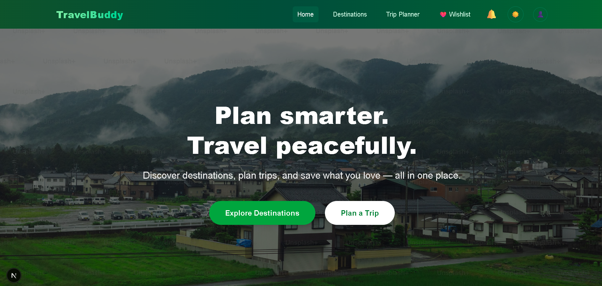
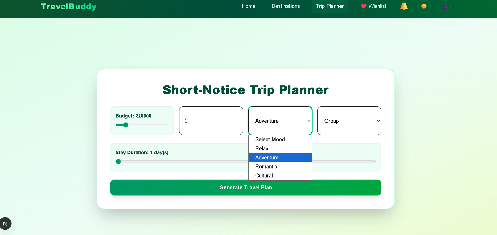

# TravelBuddy ✈️🌍

[]()
[]()

**TravelBuddy** is an all-in-one tour orchestration platform that eliminates the stress of trip planning. Whether you are looking for a quick 1-week getaway or a structured 2-week vacation, TravelBuddy handles the entire lifecycle of your trip—from ticket booking and budget management to detailed, day-by-day itinerary scheduling. 

---

## 📖 Overview

Why spend hours juggling travel sites when you can automate the entire experience? TravelBuddy is built for travelers who need a complete, end-to-end solution. The platform takes your destination and budget, then plans the entire tour, including travel tickets, stay arrangements, and daily activities. It is specifically optimized for short-term (1-2 week) tours, ensuring you get the most out of your time without the logistical headache.

Alongside full trip automation, the platform maintains a heavy focus on security with specialized features like curated women-only travel packages and a built-in hidden CCTV camera detection tool.

---

## ✨ Key Features

*   **🚀 End-to-End Tour Orchestration:** Beyond simple planning, the platform automates ticket booking and creates fully-budgeted, structured itineraries for your 1–2 week tours.
*   **💰 Smart Budget Management:** Automatically allocates your budget across travel, accommodation, and activities, ensuring you get the best experience without overspending.
*   **🛡️ Specialized Women's Packages:** Curated travel itineraries and packages designed specifically for female travelers, prioritizing verified safe accommodations and trusted transport partners.
*   **🔍 Hidden CCTV Camera Finder:** A standout digital security tool that assists users in detecting hidden surveillance devices in hotel rooms and rentals.
*   **🎨 Modern Bento-Box UI:** The platform utilizes a clean, modern "Bento Box" design layout. This highly scannable interface ensures your trip details, tickets, and safety tools are organized without visual clutter.

---

## 📸 Platform Previews

Here is a look at the TravelBuddy interface in action:


*^ **Main Dashboard:** A clean, Bento-box style overview of your upcoming trips, personalized recommendations, and quick access to safety tools.*


*^ **Trip Planner:** The intuitive itinerary builder allowing users to seamlessly organize destinations, accommodations, and daily activities.*

---

## 💻 Tech Stack

*   **Frontend:** Next.js / React
*   **Styling:** Tailwind CSS 
*   **Backend:** Node.js / Python (Django/FastAPI)

---

## 🚀 Getting Started

To run the TravelBuddy platform locally, follow these steps:

### Prerequisites
*   Node.js installed
*   Git installed

### Installation

1. **Clone the repository:**
   ```bash
   git clone [https://github.com/Megha737/travel-buddy.git](https://github.com/Megha737/travel-buddy.git)
   cd travel-buddy
   2.Navigate to the frontend and install dependencies:
   cd travel-frontend
   npm install
   3.Run the development server:
   npm run dev
